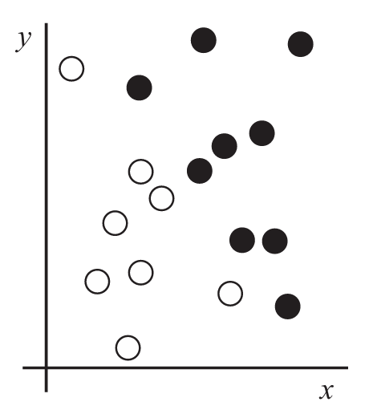
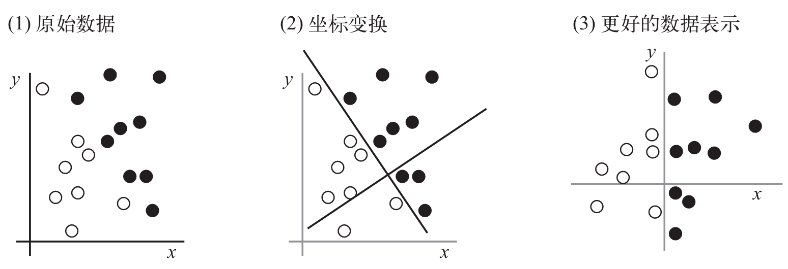

### 1.1 什么是深度学习

深度学习的三个**要素**

* 输入数据点
* 预期输出的示例
* 衡量算法效果好坏的方法

机器学习和深度学习的核心问题在于**有意义地变换数据**，换句话说，在于**学习输入数据的有用表示**（representation）。

例子：

我们想要开发一个算法，输入一个点的坐标(x, y)，就能够判断这个点是黑色还是白色。

  
通过一种新的数据表示，可以明确区分白点与黑点。可用的方法有很多，这里用的是**坐标变换**。

该任务满足深度学习的三个要素：

* 输入是点的坐标；
* 预期输出是点的颜色；
* 衡量算法效果好坏的一种方法是，正确分类的点所占的百分比。

在这个新的坐标系中，点的坐标可以看作数据的一种新的表示。利用这种新的表示，用一条简单的规则就可以描述黑/白分类问题：“x>0的是黑点”或“x<0的是白点”。这种新的表示基本上解决了该分类问题。

所有机器学习算法都包括自动寻找这样一种变换：这种变换可以根据任务将数据转化为更加有用的表示。这些操作可能是前面提到的坐标变换，也可能是线性投影（<ins>可能会破坏信息 </ins>）、平移、非线性操作（比如“选择所有x>0的点”），等等。机器学习算法在寻找这些变换时通常没有什么创造性，而仅仅是遍历一组预先定义好的操作，这组操作叫作**假设空间**（hypothesis space）。

机器学习的技术定义：在预先定义好的可能性空间中，利用反馈信号的指引来寻找输入数据的有用表示。
